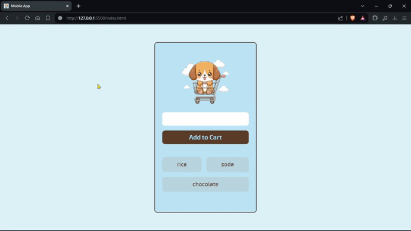

# Build Mobile App



## *Screenshots* :camera:


## *Link* :link:

[Live Site URL](https://mendezpvi.github.io/fcp-mobile-app/) 👀

[Scrimba projects]([https://mendezpvi.github.io/fcp-mobile-app/](https://github.com/mendezpvi/fcp-scrimba)) 👀

## Steps:

1️⃣ Add the input value to the DB.

2️⃣ Render the DB items.

3️⃣ Remove item duplication (bug generated when adding a new item).

4️⃣ Retrieve `key` of the current item to be deleted.

5️⃣ Create element in DOM using `createElement`.

6️⃣ Delete item by clicking on it.

7️⃣ Check if items exist in the DB.

8️⃣ Edit Manifest.

## *I learnt* :nerd_face:

✅ import  
```js
import { initializeApp } from "https://www.gstatic.com/firebasejs/9.15.0/firebase-app.js"
import { getDatabase, ref, push, onValue, remove } from "https://www.gstatic.com/firebasejs/9.15.0/firebase-database.js"
```

✅ Firebase: initializeApp  
```js
const appSettings = {
  databaseURL: "https://shopping-list-e9203-default-rtdb.firebaseio.com/"
}
const app = initializeApp(appSettings)
```

✅ Firebase: getDatabase  
```js
const database = getDatabase(app)
```

✅ Firebase: reference  
```js
const shoppingListInDB = ref(database, "shoppingList")
```

✅ Firebase: push  
```js
push(shoppingListInDB, inputValue)
```

✅ Firebase: onValue

✅ Firebase: snapshot  
```js
onValue(shoppingListInDB, function(snapshot) {
  // CODE
})
```

✅ ID's

✅ Firebase: remove  
```js
remove(exactLocationItemInDB)
```

✅ Object ➡️ Array  
```js
let itemsArr = Object.entries(snapshot.val())
```

✅ createElement  
```js
const LI = document.createElement("LI")
LI.textContent = itemValue
```

✅ Flexbox: flex-wrap

✅ Flexbox: gap

✅ user-select

✅ Setting the viewport  
```html
<meta name="viewport" content="width=device-width, initial-scale=1.0">
```

✅ Favicon

✅ Web Application Manifest  
```json
{
  "name": "Shopping List",
  "short_name": "Shopping List",
  "icons": [
    {
      "src": "./assets/favicon/android-chrome-192x192.png",
      "sizes": "192x192",
      "type": "image/png"
    },
    {
      "src": "./assets/favicon/android-chrome-512x512.png",
      "sizes": "512x512",
      "type": "image/png"
    }
  ],
  "theme_color": "#593c27",
  "background_color": "#DCF3FA",
  "display": "standalone"
}
```

## *Author* :beginner:

✨ Frontend Mentor - [@mendezpvi](https://www.frontendmentor.io/profile/mendezpvi)
